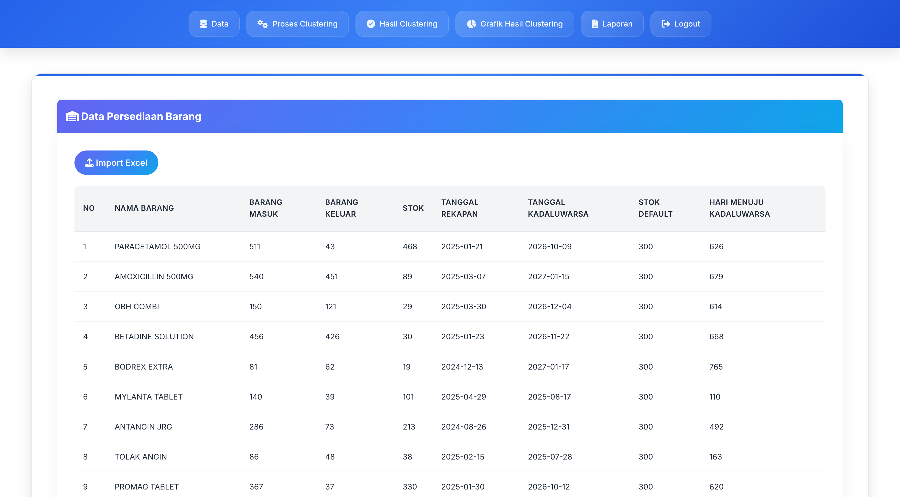
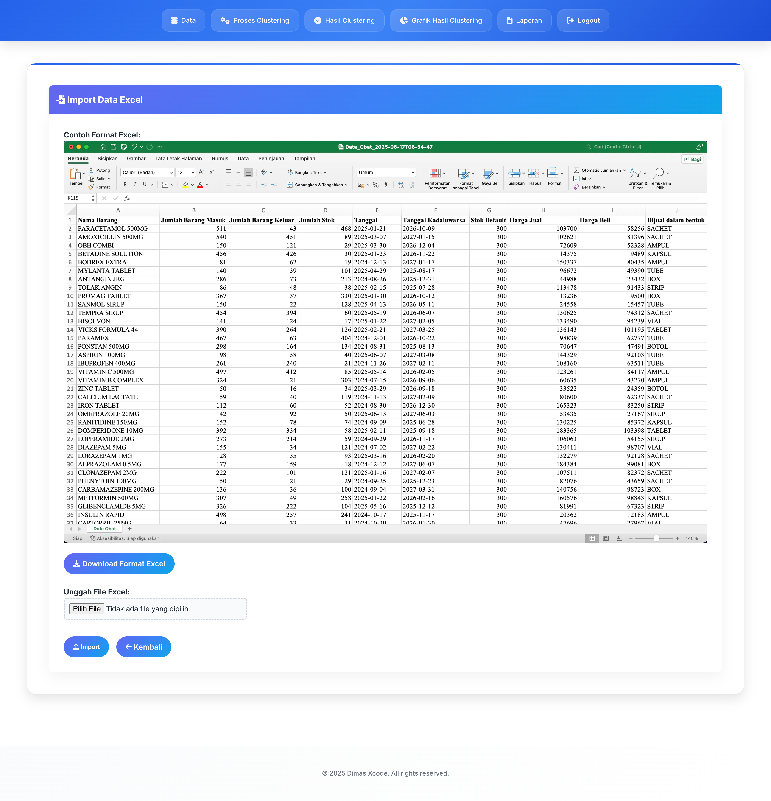
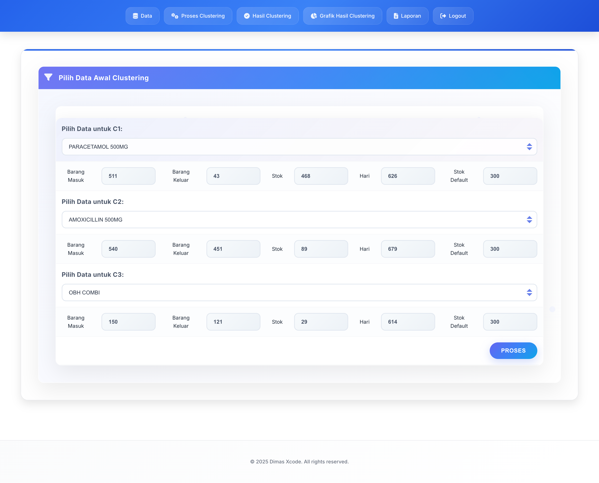
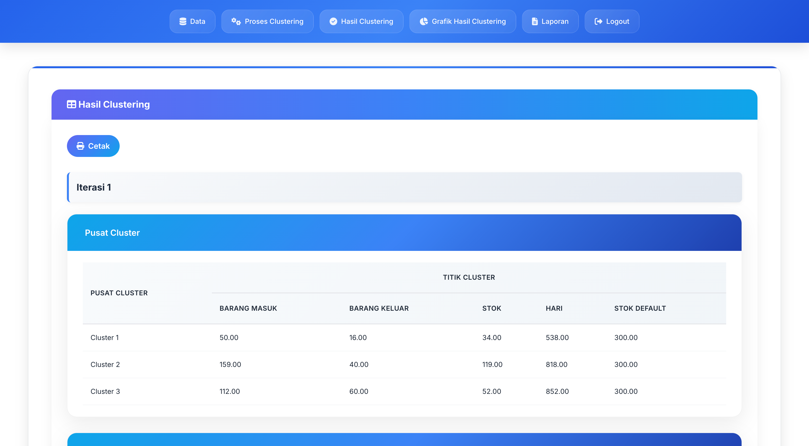
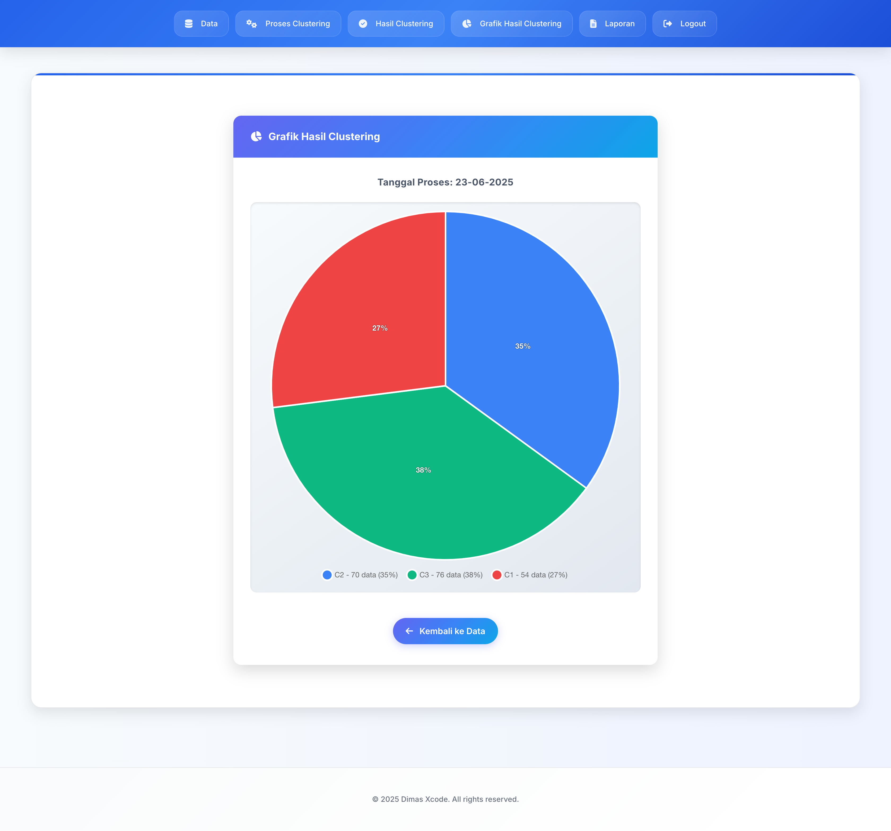
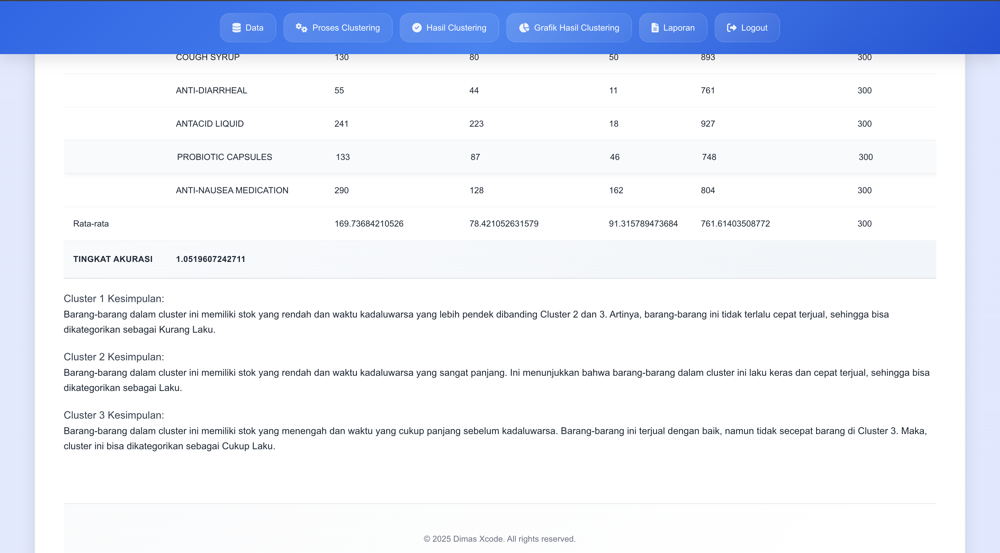

# 💊 K-Means Clustering untuk Manajemen Stok Obat 📦

Sistem Web Premium & Modern untuk Klasterisasi Pengelolaan Persediaan Obat Rumah Sakit/Apotek menggunakan **Algoritma K-Means**. Dengan akurasi hingga **98,21%**, sistem ini mampu melakukan **klasterisasi stok obat secara presisi dan konsisten** untuk mendukung pengambilan keputusan yang tepat. 🚀

---

## ✨ Fitur Unggulan

- 🎯 **Akurasi Tinggi (98,21%)** menggunakan validasi DBI (Davies-Bouldin Index)
- 💡 **Analisis Per Cluster** untuk memahami pola distribusi stok obat
- 📊 **Visualisasi Data Interaktif** (Pie Chart, Bar Chart, dll)
- 📁 **Manajemen Data Obat** yang fleksibel & real-time
- 🧠 **Algoritma K-Means Otomatis** untuk pengelompokan optimal
- 🎨 **UI Premium & Responsive** dengan gaya modern ala SaaS

---

## 🛠️ Teknologi yang Digunakan

- **Backend**: PHP Native
- **Frontend**: HTML5, CSS3, JavaScript (jQuery, Chart.js)
- **Database**: MySQL
- **Library Clustering**: K-Means Custom Algorithm (tanpa framework)

---

## 🚀 Cara Menjalankan Aplikasi

1. Clone repositori ini:
https://github.com/yyusronwirawan/kmeans-stok-obat.git
Import database:

Buka folder database/

Import file db_k-means.sql ke MySQL melalui phpMyAdmin

Jalankan server lokal:

Gunakan XAMPP/Laragon

Letakkan folder di dalam htdocs

Akses aplikasi melalui browser:
http://localhost/kmeans-stok-obat/

📈 Hasil dan Akurasi Sistem
🧪 Setelah dilakukan pengujian terhadap data real stok obat, sistem menunjukkan akurasi klasterisasi sebesar 98,21% berdasarkan indeks Davies-Bouldin. Hasil pengelompokan juga menunjukkan tingkat konsistensi tinggi terhadap karakteristik data stok, seperti frekuensi penggunaan, volume, dan urgensi distribusi.

💼 Sistem ini layak digunakan sebagai alat bantu pengambilan keputusan oleh manajer logistik, apoteker, maupun kepala gudang dalam menetapkan strategi penyediaan dan distribusi obat.

🤝 Kontribusi
Kami terbuka untuk kontribusi! Jika kamu ingin membantu mengembangkan fitur atau memperbaiki bug, silakan lakukan pull request atau buka issue baru.

📧 Kontak
Jika kamu memiliki pertanyaan atau saran, silakan hubungi:

Email: yusronwirawan@yahoo.com

📃 Lisensi
Proyek ini dilisensikan di bawah MIT License – silakan lihat file LICENSE untuk informasi lebih lanjut.

Terima kasih telah menggunakan sistem ini! 🙏

